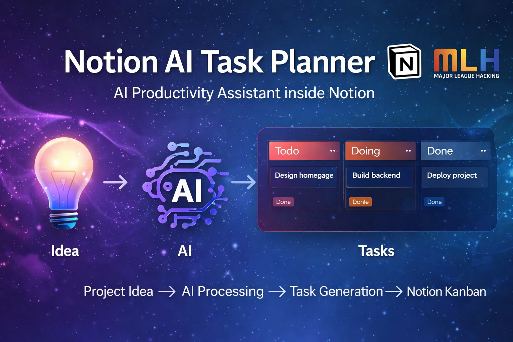
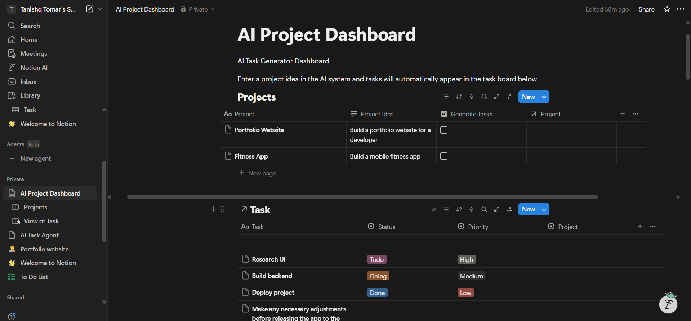
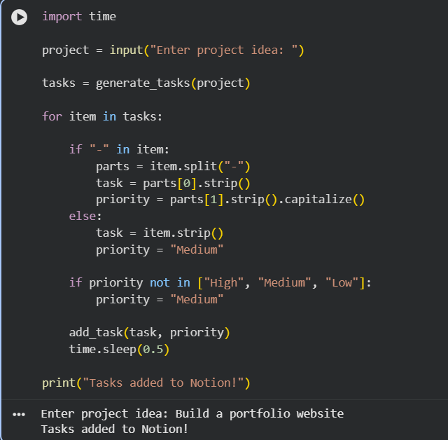
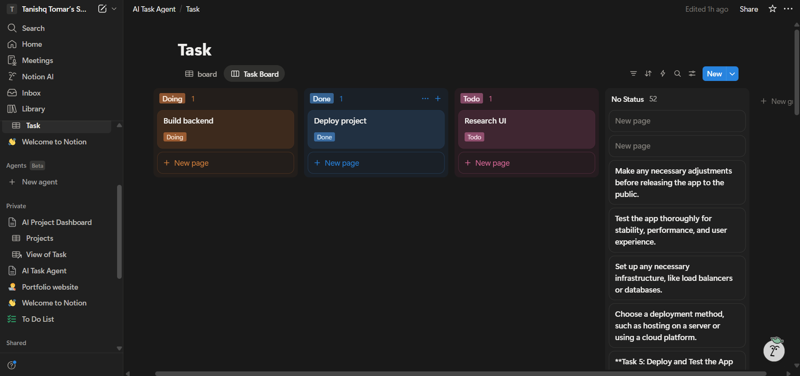

<h1 align="center">🚀 Notion AI Task Planner</h1>

AI-powered productivity assistant that converts project ideas into actionable tasks inside a Notion workspace.

---

<h2 align="center">🧠 How It Works</h2>

Project Idea ➜ AI Processing ➜ Task Generation ➜ Notion Kanban Board

---

<h2 align="center">✨ Features</h2>

<ul>
<li>🤖 AI powered task generation</li>
<li>📋 Automatic task creation in Notion</li>
<li>🗂 Kanban workflow (Todo → Doing → Done)</li>
<li>⚡ Task prioritization (High / Medium / Low)</li>
<li>🔗 Project-to-task linking</li>
</ul>

---

<h2 align="center">📸 Screenshots</h2>

<h3>AI Project Dashboard</h3>

Users add project ideas in the dashboard.

---

<h3>AI Agent Running</h3>

The AI agent processes the idea and generates tasks.

---

<h3>Notion Kanban Board</h3>

Tasks automatically appear in the Notion task board.

---

<h2 align="center">⚙️ Tech Stack</h2>

<table align="center">
<tr>
<th>Technology</th>
<th>Purpose</th>
</tr>

<tr>
<td>Python</td>
<td>Automation logic</td>
</tr>

<tr>
<td>Groq AI</td>
<td>Task generation</td>
</tr>

<tr>
<td>Notion API</td>
<td>Workflow automation</td>
</tr>

<tr>
<td>Google Colab</td>
<td>Execution environment</td>
</tr>

</table>

---

<h2 align="center">🚀 Run The Project</h2>

<pre>
pip install notion-client groq
</pre>

Add your API keys:

<pre>
NOTION_TOKEN = "YOUR_NOTION_TOKEN"
GROQ_API_KEY = "YOUR_GROQ_API_KEY"
</pre>

Run the notebook and enter a project idea.

---

<h2 align="center">🏗 Architecture</h2>

<pre>
User Idea
   │
   ▼
AI Task Generator
   │
   ▼
Python Automation
   │
   ▼
Notion API
   │
   ▼
Notion Kanban Board
</pre>

---

<h2 align="center">👨‍💻 Author</h2>

<b>Tanishq Tomar</b> 
Built for MLH Hackathon 🚀

